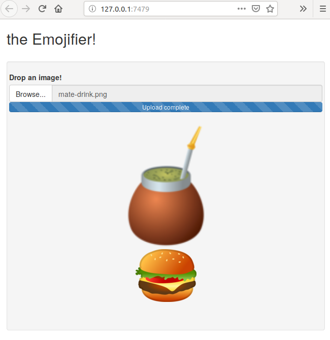

# LatinR 2019

## Auto-Keras: An R easily accessible deep learning library

### Dependencies

In order to reproduce this presentation steps, the following libraries
must be installed:

``` r
install.packages(c(
  "abind", "dplyr", "ggplot2", "keras", "reshape2", "rstudioapi", "rvest",
  "shiny", "xfun"
))

if (!require("remotes")) {
  install.packages("remotes")
}
remotes::install_github("jcrodriguez1989/autokeras", dependencies = TRUE)
```

### Creating the classifier

Follow the steps of each file to get:

  - `01_get_data.R` to download all emoji pictures from
    [Emojipedia](https://emojipedia.org/).
  - `02_imgs_to_array.R` to transform all these pictures to an R array.
  - `03_fit_model.R` to fit the `autokeras` model.
  - `04_predict.R` to predict categories for new emojis.

### Fast Model Writing

Steps to reproduce Fast Model Writing:

1)  Open RStudio
2)  In the `Console` pane type `source("presentation.R")`
3)  Open a New File, in the New File `Source` pane type the letter `i`
    and press the `Tab` key. It will start writing super fast on the New
    File.
4)  After, to start typing the emojized version, in the `Source` pane
    type the letter `s` and press the `Tab` key.

### Emojifier

The Emojifier is a Shiny app that will load the previously trained
model. This app allows to drop any image and generate a predicted
category for
it.



### 2019 emoji trivia

The 2019 emoji trivia is a Shiny app that will show each of the 2019 new
emojis and lets the user guess into which category it was classified.
This Shiny app can also be found at
[shinyapps.io](https://jcrodriguez.shinyapps.io/Emojifier/).


If the four emojis are correctly classified by the user, then as a prize
it will provide a link to the Emojizer RStudio
addin:


