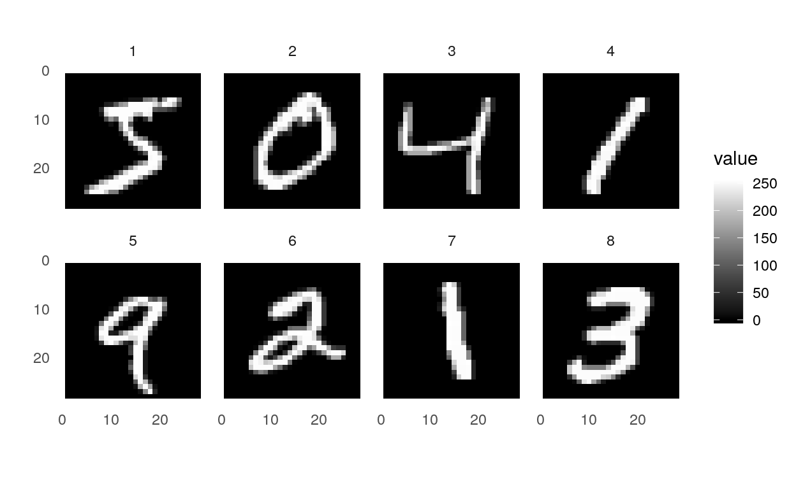
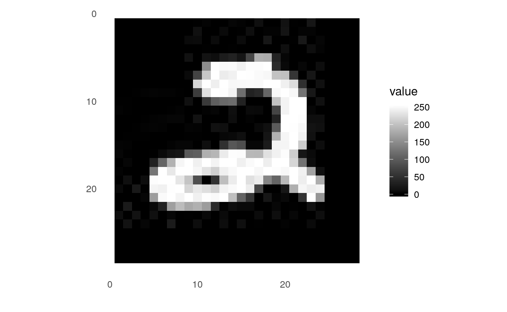

```{r}
knitr::opts_chunk$set(echo = TRUE, eval = FALSE)
```

_Today, we're happy to feature a guest post written by Juan Cruz, showing how to use Auto-Keras from R. Juan holds a master’s degree in Computer Science. Currently, he is finishing his master’s degree in Applied Statistics, as well as a Ph.D. in Computer Science, at the Universidad Nacional de Córdoba. He started his R journey almost six years ago, applying statistical methods to biology data. He enjoys software projects focused on making machine learning and data science available to everyone._

In the past few years, artificial intelligence has been a subject of intense media hype. Machine learning, deep learning, and artificial intelligence come up in countless articles, often outside of technology-minded publications. For most any topic, a brief search on the web yields dozens of texts suggesting the application of one or the other deep learning model. 

However, tasks such as feature engineering, hyperparameter tuning, or network design, are by no means easy for people without a rich computer science background. Lately, research started to emerge in the area of what is known as Neural Architecture Search (NAS) [@baker2016designing; @pham2018efficient; @zoph2016neural; @luo2018neural; @liu2017hierarchical; @real2018regularized; @jin2018efficient]. The main goal of NAS algorithms is, given a specific tagged dataset, to search for the most optimal neural network to perform a certain task on that dataset. In this sense, NAS algorithms allow the user to not have to worry about any task related to data science engineering. In other words, given a tagged dataset and a task, e.g., image classification, or text classification among others, the NAS algorithm will train several high-performance deep learning models and return the one that outperforms the rest.

Several NAS algorithms were developed on different platforms (e.g. [Google Cloud AutoML](https://cloud.google.com/automl/)), or as libraries of certain programming languages (e.g. [Auto-Keras](https://autokeras.com/), [TPOT](https://epistasislab.github.io/tpot/), [Auto-Sklearn](https://www.automl.org/automl/auto-sklearn/)). However, for a language that brings together experts from such diverse disciplines as is the R programming language, to the best of our knowledge, there is no NAS tool to this day. In this post, we present the Auto-Keras R package, an interface from R to the [Auto-Keras Python library](https://autokeras.com/) [@jin2018efficient]. Thanks to the use of Auto-Keras, R programmers with few lines of code will be able to train several deep learning models for their data and get the one that outperforms the others.

Let's dive into Auto-Keras!

## Auto-Keras

**Note:** the Python Auto-Keras library is only compatible with Python 3.6. So make sure this version is currently installed, and correctly set to be used by the [`reticulate`](https://rstudio.github.io/reticulate/) R library.

### Installation

To begin, install the autokeras R package from GitHub as follows:

```{r eval = FALSE}
if (!require("remotes")) {
  install.packages("remotes")
}
remotes::install_github("jcrodriguez1989/autokeras")
```

The Auto-Keras R interface uses the Keras and TensorFlow backend engines by default. To install both the core Auto-Keras library as well as the Keras and TensorFlow backends use the `install_autokeras()` function:

```{r eval = FALSE}
library("autokeras")
install_autokeras()
```

This will provide you with default CPU-based installations of Keras and TensorFlow. If you want a more customized installation, e.g. if you want to take advantage of NVIDIA GPUs, see the documentation for [`install_keras()`](https://keras.rstudio.com/reference/install_keras.html) from the `keras` R library.

### MNIST Example

We can learn the basics of Auto-Keras by walking through a simple example: recognizing handwritten digits from the [MNIST](https://en.wikipedia.org/wiki/MNIST_database) dataset. MNIST consists of 28 x 28 grayscale images of handwritten digits like this:

```{r mnistJpg, echo = FALSE, eval = TRUE, fig.align = "center", out.width = "120px"}
knitr::include_graphics("images/img_1.jpg")
```

The dataset also includes labels for each image, telling us which digit it is. For example, the label for the above image is 2.

#### Loading the Data

The MNIST dataset is included with Keras and can be accessed using the [`dataset_mnist()`](https://keras.rstudio.com/reference/index.html#section-datasets) function from the `keras` R library. Here we load the dataset, and then create variables for our test and training data:

```{r}
library("keras")
mnist <- dataset_mnist() # load mnist dataset
c(x_train, y_train) %<-% mnist$train # get train
c(x_test, y_test) %<-% mnist$test # and test data
```

The `x` data is a 3-d array `(images,width,height)` of grayscale integer values ranging between 0 to 255.

```{r}
x_train[1, 14:20, 14:20] # show some pixels from the first image
```

         [,1] [,2] [,3] [,4] [,5] [,6] [,7]
    [1,]  241  225  160  108    1    0    0
    [2,]   81  240  253  253  119   25    0
    [3,]    0   45  186  253  253  150   27
    [4,]    0    0   16   93  252  253  187
    [5,]    0    0    0    0  249  253  249
    [6,]    0   46  130  183  253  253  207
    [7,]  148  229  253  253  253  250  182

The `y` data is an integer vector with values ranging from 0 to 9.

```{r}
n_imgs <- 8
head(y_train, n = n_imgs) # show first 8 labels
```

    [1] 5 0 4 1 9 2 1 3

Each of these images can be plotted in R:

```{r}
library("ggplot2")
library("tidyr")
# get each of the first n_imgs from the x_train dataset and
# convert them to wide format
mnist_to_plot <-
  do.call(rbind, lapply(seq_len(n_imgs), function(i) {
    samp_img <- x_train[i, , ] %>%
      as.data.frame()
    colnames(samp_img) <- seq_len(ncol(samp_img))
    data.frame(
      img = i,
      gather(samp_img, "x", "value", convert = TRUE),
      y = seq_len(nrow(samp_img))
    )
  }))
ggplot(mnist_to_plot, aes(x = x, y = y, fill = value)) + geom_tile() +
  scale_fill_gradient(low = "black", high = "white", na.value = NA) +
  scale_y_reverse() + theme_minimal() + theme(panel.grid = element_blank()) +
  theme(aspect.ratio = 1) + xlab("") + ylab("") + facet_wrap(~img, nrow = 2)
```

```{r, echo = FALSE, eval = TRUE, fig.align = "center"}

```

While we are going to use the pre-loaded MNIST dataset, Keras also provides [Image Preprocessing](https://keras.rstudio.com/reference/index.html#section-image-preprocessing) functions to easily load images. For instance, if we have an image in the file path `"images/img_1.jpg"`, then we can load it by doing (and then plot it as shown above):

```{r}
sample_img <-
  image_load("images/img_1.jpg", grayscale = TRUE) %>%
  image_to_array() %>%
  as.data.frame()
```

```{r, echo = FALSE, eval = TRUE, fig.align = "center", out.width = "240px"}

```

#### Data ready, let's get the model!

Data pre-processing? Model definition? Metrics, epochs definition, anyone? No, none of them are required by Auto-Keras. For image classification tasks, it is enough for Auto-Keras to be passed the `x_train` and `y_train` objects as defined above.


So, to train several deep learning models for two hours, it is enough to run:

```{r, eval = FALSE}
# train an Image Classifier for two hours
clf <- model_image_classifier(verbose = TRUE) %>%
  fit(x_train, y_train, time_limit = 2 * 60 * 60)
```

    Saving Directory: /tmp/autokeras_ZOG76O
    Preprocessing the images.
    Preprocessing finished.
    
    Initializing search.
    Initialization finished.
    
    
    +----------------------------------------------+
    |               Training model 0               |
    +----------------------------------------------+
    
    No loss decrease after 5 epochs.
    
    
    Saving model.
    +--------------------------------------------------------------------------+
    |        Model ID        |          Loss          |      Metric Value      |
    +--------------------------------------------------------------------------+
    |           0            |  0.19463148526847363   |   0.9843999999999999   |
    +--------------------------------------------------------------------------+
    
    
    +----------------------------------------------+
    |               Training model 1               |
    +----------------------------------------------+
    
    No loss decrease after 5 epochs.
    
    
    Saving model.
    +--------------------------------------------------------------------------+
    |        Model ID        |          Loss          |      Metric Value      |
    +--------------------------------------------------------------------------+
    |           1            |   0.210642946138978    |         0.984          |
    +--------------------------------------------------------------------------+


Evaluate it:

```{r, eval = FALSE}
clf %>% evaluate(x_test, y_test)
```

    [1] 0.9866

And then just get the best-trained model with:

```{r, eval = FALSE}
clf %>% final_fit(x_train, y_train, x_test, y_test, retrain = TRUE)
```

    No loss decrease after 30 epochs.

Evaluate the final model:

```{r, eval = FALSE}
clf %>% evaluate(x_test, y_test)
```

    [1] 0.9918

And the model can be saved to take it into production with:

```{r, eval = FALSE}
clf %>% export_autokeras_model("./myMnistModel.pkl")
```

### Conclusions

In this post, the Auto-Keras R package was presented. It was shown that, with almost no deep learning knowledge, it is possible to train models and get the one that returns the best results for the desired task. Here we trained models for two hours. However, we have also tried training for 24 hours, resulting in 15 models being trained, to a final accuracy of 0.9928. Although Auto-Keras will not return a model as efficient as one generated manually by an expert, this new library has its place as an excellent starting point in the world of deep learning. Auto-Keras is an open-source R package, and is freely available in [https://github.com/jcrodriguez1989/autokeras/](https://github.com/jcrodriguez1989/autokeras/).

Although the Python Auto-Keras library is currently in a pre-release version and comes with not too many types of training tasks, this is likely to change soon, as the project it was recently added to the _keras-team_ set of repositories. This will undoubtedly further its progress a lot.
So stay tuned, and thanks for reading!

### Reproducibility

To correctly reproduce the results of this post, we recommend using the Auto-Keras docker image by typing:

```{bash eval = FALSE}
docker pull jcrodriguez1989/r-autokeras:0.1.0
docker run -it jcrodriguez1989/r-autokeras:0.1.0 /bin/bash
```
